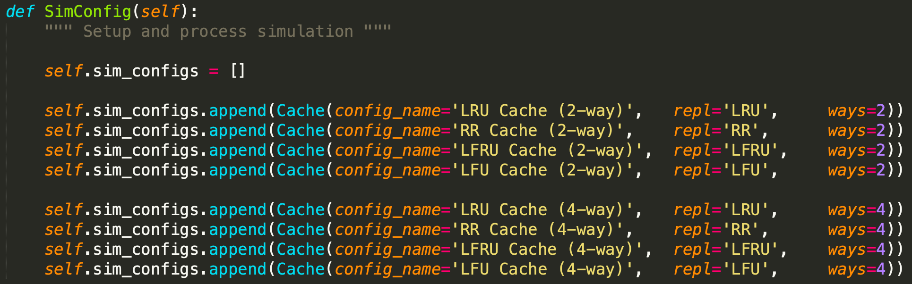

# Replacement Policy Simulation

# 1 Overview 

## Dependencies

The following dependencies will need to be installed

``` 
pip3 install xlsxwriter plotly argparse
```

## Configuration

Memory can be...

- Read from a file
- Randomly generated

The memory and cache sizes can be configured with command line arguments.

The simulations that will be ran can be changed in src/simulation.py in the SimConfig function. This file will allow you to add/remove simulations along with change the replacement policy and the set associativity.

<p align="center">
  
</p>

## Output

Data will be saved to an excel workbook and a graph demonstrating the hit ratio. These will be located in the output folder

## Supported Replacement Policies

- LRU: Least Recently Used
    - Discards the least recently used items first.
- RR: Random Replacement
    - Randomly chooses which item to discard
- LFRU: Least Frequently Recently Used
    - Replaces an item with the least usage and the least recently used
- LFU: Least Frequently Used
    - Replaces an item with the least usage

# 2 Running

## Command Line Arguments

| Long        | Description                             |
|-------------|-----------------------------------------|
| --file      | Input file containing memory addresses  |
| --memsize   | Size of memory file to be generated     |
| --memrange  | Max memory value to be generated        |
| --cachesize | Size of the cache                       |
| --linesize  | Size of the cache line                  |
      
All arguments are optional. memsize and memrange are used when auto generating a memory file. file is used to read in a memory file. memsize and memrange can't be used with file. 


## Examples

Running with a memory file

```
python3 run.py -f mem/sample_mem.txt 
```

Running with auto generated memory

```
python3 run.py --memsize 2000 --memrange 2000 
```

Running with a configured cache

```
python3 run.py --cachesize 64KB --linesize 32B
```

# Authors

* Jake Summerville
* Henry Lee
* Martin Lopez
* Fausto Sanchez
